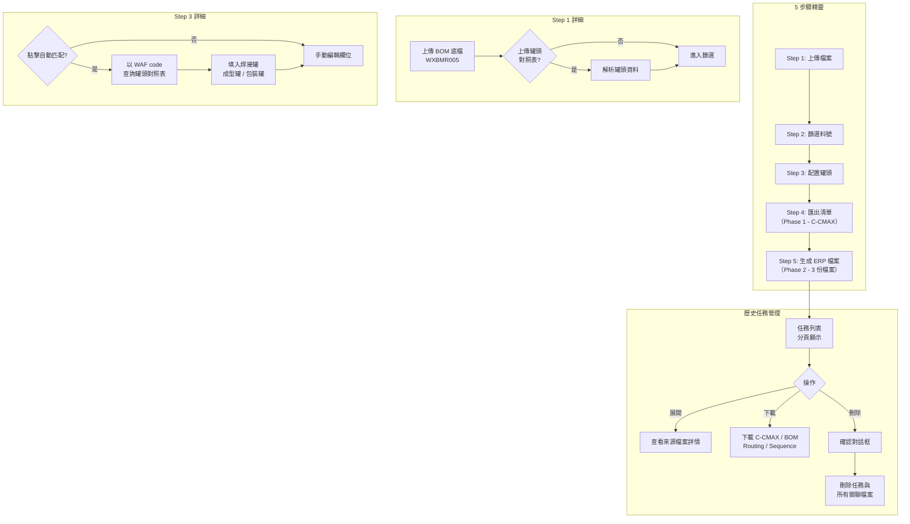

# 產品需求規格書（PRD）

**產品名稱**：BOM 表自動生成系統（Auto-BOM）
**版本**：v1.0
**撰寫日期**：2026-05-14

---

## 1. 需求概述

### 1.1 背景

目前 BOM（Bill of Materials）表的製作流程高度依賴人工手動操作。工程人員需將 BOM 底檔中的料號資料逐一填入多份表格，包含 C-CMAX 導入清單及 3 份 ERP 上傳檔案（pj_bom_loader、routings、sequences-raw）。這些檔案欄位繁多（20～99 欄），格式各異，每次製作耗時數小時且極易出錯。此外，罐頭對照表與標準作業工序資訊散落各處，每次均需人工查找比對，增加作業負擔。

### 1.2 目標

- 透過上傳 BOM 底檔，自動產出 C-CMAX 導入清單及 3 份 ERP 上傳檔案，取代人工逐欄填寫
- 提供罐頭對照表上傳與自動匹配功能，減少人工比對作業
- 提供標準作業檔案上傳，自動帶入工序資料
- 建立歷史任務管理機制，支援查閱、下載及刪除
- 提供多國語系介面（簡體中文、繁體中文、英文）

### 1.3 範圍

**包含項目：**

- 5 步驟精靈式操作介面（上傳 → 篩選 → 配置 → 匯出清單 → 生成檔案）
- BOM 底檔（WXBMR005）上傳與解析
- 罐頭對照表上傳與自動匹配
- 標準作業檔案（WXBMR004）上傳與解析
- C-CMAX 導入清單生成（含料號清單 + 罐頭兩個工作表）
- 3 份 ERP 上傳檔案生成（pj_bom_loader、routings、sequences-raw）
- 歷史任務管理（列表、詳情、下載、刪除、分頁）
- 多國語系支援

**不包含項目：**

- 使用者權限管理與登入認證
- 與 C-CMAX / ERP 系統的直接串接
- 檔案自動上傳至 ERP 系統
- 多人協作與任務分享

---

## 2. 使用者故事

### Story 1
- **As a** 製程工程師
- **I want** 上傳 BOM 底檔後自動生成 C-CMAX 導入清單及 ERP 上傳檔案
- **So that** 不需手動逐一填寫多份表格，大幅節省作業時間並降低人為錯誤

### Story 2
- **As a** 製程工程師
- **I want** 上傳罐頭對照表後系統自動匹配焊接罐、成型罐、包裝罐欄位
- **So that** 不需每次人工查找比對罐頭代碼，減輕重複性作業負擔

### Story 3
- **As a** 製程工程師
- **I want** 查看歷史生成任務並下載已產出的檔案
- **So that** 隨時可回溯過往紀錄，不需重新生成

### Story 4
- **As a** 製程工程師
- **I want** 篩選 BOM 底檔中的特定料號進行生成
- **So that** 可針對部分料號單獨作業，而非一次處理整份底檔

### Story 5
- **As a** 製程工程師
- **I want** 在配置階段手動修改自動匹配的罐頭資料及替代結構
- **So that** 自動匹配不完整或有誤時可即時修正

---

## 3. 功能規格

### 3.1 Step 1：上傳檔案

- **描述**：使用者上傳 BOM 底檔（必填）及罐頭對照表（選填），系統解析後進入下一步驟。
- **頁面流程**：兩欄式排版，左側為 BOM 底檔上傳區、右側為罐頭對照表上傳區。上傳成功後顯示檔名與資料筆數，點擊「下一步」進入篩選。

**BOM 底檔解析欄位：**

| 欄位名稱 | 說明 |
|----------|------|
| 料號 | 品項料號 |
| 摘要 | 品項描述 |
| 內規文件編號 | 文件編號 |
| 大分類 | 產品大分類 |
| 中分類 | 產品中分類 |
| 替代結構 | 替代結構代碼 |
| BOM 附注 | 附加說明 |
| TYPE | 類型 |
| FAMILY | 系列 |
| PACKAGE | 封裝 |
| LINE | 產線 |
| FUNCTION | 功能別（如 SKY / SUPER）|
| 料號序號 | 序號 |
| 原件 WAF | WAF 代碼 |
| 原件摘要 | 原件完整描述（含供應商、晶圓尺寸等）|

**罐頭對照表欄位：**

| 欄位名稱 | 說明 |
|----------|------|
| FUNCTION | 功能別 |
| WAF 代碼 | 匹配鍵值 |
| 供應商 | 供應商名稱 |
| 晶圓尺寸 | 晶圓規格 |
| Mil 規格 | Mil 數值 |
| 焊接罐頭代碼 | 焊接罐頭編號 |
| 焊接罐頭描述 | 焊接罐頭說明 |
| 成型罐頭代碼 | 成型罐頭編號 |
| 成型罐頭描述 | 成型罐頭說明 |
| 包裝罐頭代碼 | 包裝罐頭編號 |
| 包裝罐頭描述 | 包裝罐頭說明 |

**規則：**
- 僅接受 Excel 格式（.xlsx / .xls）
- BOM 底檔為必要上傳項，罐頭對照表為選填

---

### 3.2 Step 2：篩選料號

- **描述**：顯示 BOM 底檔中所有不重複料號，使用者可搜尋並勾選欲生成的料號。
- **頁面流程**：上方搜尋列 + 全選/取消全選按鈕 + 已選數量計數器，下方為可捲動表格，底部為上一步/下一步按鈕。

**表格欄位：**

| 欄位名稱 | 說明 |
|----------|------|
| 勾選框 | 選取/取消選取 |
| 料號 | 品項料號 |
| TYPE | 類型 |
| FAMILY | 系列 |
| PACKAGE | 封裝 |
| 原件 | WAF 代碼 |
| 摘要 | 原件摘要（截斷顯示）|

**規則：**
- 至少選取 1 筆料號方可進入下一步
- 搜尋範圍：料號、摘要、TYPE、FAMILY
- 料號自動去重

---

### 3.3 Step 3：配置罐頭

- **描述**：顯示已選料號的罐頭配置，支援自動匹配與手動編輯。
- **頁面流程**：上方「自動匹配罐頭」按鈕 + 匹配結果統計，下方為可編輯表格，底部為上一步/下一步按鈕。

**表格欄位：**

| 欄位名稱 | 可編輯 | 說明 |
|----------|--------|------|
| 料號 | 否 | 品項料號 |
| 原件 | 否 | WAF 代碼 |
| 替代結構 | 是 | 替代結構代碼 |
| 焊接罐 | 是 | 焊接罐頭代碼（匹配成功綠底顯示）|
| 成型罐 | 是 | 成型罐頭代碼 |
| 包裝罐 | 是 | 包裝罐頭代碼 |

**自動匹配邏輯：**
1. 以料號的原件 WAF 代碼為鍵值，查詢罐頭對照表
2. 精確匹配成功後，自動填入焊接罐、成型罐、包裝罐
3. 顯示匹配成功數量與未匹配料號清單

**規則：**
- 所有欄位皆為選填，允許空值進入下一步
- 使用者可在自動匹配後手動覆蓋修改

---

### 3.4 Step 4：匯出清單（Phase 1）

- **描述**：生成 C-CMAX 導入清單，含「料號清單」與「罐頭」兩個工作表。
- **頁面流程**：上方摘要統計 + 預覽表格，「生成導入清單」按鈕觸發生成，完成後顯示下載按鈕，點擊「Phase 2」進入下一步。

**產出檔案 — C-CMAX 導入清單：**

工作表 1「料號清單」（20 欄）：料號、摘要、內規文件編號、大分類、中分類、替代結構、MAX 替代結構、TYPE、FAMILY、PACKAGE、LINE、FUNCTION、料號序號、原件、原件摘要、晶片供應商、Wafer Type、原件附注、單位用量、原件生效時間

工作表 2「罐頭」（16 欄）：FUNCTION、WAF 代碼、供應商、晶圓尺寸、Wafer Type、mil（數值）、mil（字串）、厚度、金屬層、附注、焊接罐頭、焊接描述、成型罐頭、成型描述、包裝罐頭、包裝描述

---

### 3.5 Step 5：生成 ERP 檔案（Phase 2）

- **描述**：上傳標準作業檔案（WXBMR004）後生成 3 份 ERP 上傳檔案。
- **頁面流程**：上方警示提示上傳正確檔案，兩欄排版（左：C-CMAX 已完成指示、右：標準作業上傳區），下方顯示 3 份輸出檔案狀態與下載按鈕。

**產出檔案 1 — pj_bom_loader（23 欄）：**
組裝料號、替代結構、作業序號（10/20/30/80）、元件（WAF/焊接罐/成型罐/包裝罐）、ERP 數量、良品率、BOP、PROCESS_SPEC、BOM_NAME 等。每筆料號最多產生 4 列，罐頭值為空時跳過該列。

**產出檔案 2 — routings（60 欄）：**
替代結構、路由類型、需求來源類型、組織代碼、組裝料號、處理標記、交易類型等。以（料號 + MAX 替代結構）去重，每組一列。

**產出檔案 3 — sequences-raw（99 欄）：**
工序序號（12 道固定工序：切割/焊接/成型/切腳/Burning/外包前/貝維特/佰潤/欣捷/外包後/TMTT/FQC）、標準作業 ID、工序描述、替代結構、組織代碼、組裝料號、部門代碼等。每筆不重複料號產生 12 列。

**規則：**
- 須先上傳標準作業檔案方可生成
- 僅接受 Excel 格式

---

### 3.6 歷史任務管理

- **描述**：列表展示所有歷史任務，支援檢視詳情、下載檔案及刪除。
- **頁面流程**：分頁列表（每頁 10 筆）→ 點擊展開詳情 → 查看來源檔案資訊 → 下載或刪除。

**列表顯示：**

| 欄位名稱 | 說明 |
|----------|------|
| 任務名稱 | 任務名稱（截斷顯示）|
| 狀態 | 草稿 / 處理中 / 已完成 / 失敗 |
| 料號數量 | 該任務包含的料號筆數 |
| 建立時間 | 任務建立時間 |
| 下載按鈕 | C-CMAX / BOM / Routing / Sequence（有檔案時顯示）|
| 刪除按鈕 | 觸發確認對話框 |

**展開詳情 — 來源檔案資訊：**

| 檔案類型 | 顯示內容 |
|----------|---------|
| BOM 底檔 | 檔名、資料筆數 |
| 罐頭對照表 | 檔名、資料筆數 |
| 標準作業 | 檔名、資料筆數 |

**刪除規則：**
- 刪除前需經確認對話框二次確認
- 刪除後同步清除所有關聯的上傳檔案與輸出檔案

---

## 4. 非功能需求

- **效能**：
  - BOM 底檔上傳解析 ≤ 5 秒（500 列以內）
  - C-CMAX 導入清單生成 ≤ 10 秒
  - 3 份 ERP 檔案生成 ≤ 30 秒
  - 歷史任務列表回應 ≤ 1 秒

- **安全性**：
  - 僅接受 Excel 格式檔案上傳
  - 刪除操作需二次確認
  - 任務刪除後檔案完全清除不殘留

- **相容性**：
  - 支援 Chrome / Edge / Firefox 最新兩個主版本
  - 適配桌面瀏覽器（最小寬度 1024px）
  - 支援簡體中文（預設）、繁體中文、英文

---

## 5. 驗收標準

| 編號 | 驗收項目 | 驗收條件 | 通過標準 |
|------|---------|---------|---------|
| AC-01 | BOM 底檔上傳 | 上傳 WXBMR005 Excel 檔案 | 成功解析並顯示料號列表與筆數 |
| AC-02 | 罐頭對照表上傳 | 上傳含罐頭工作表的 Excel 檔案 | 成功解析並顯示匯入筆數 |
| AC-03 | 料號篩選 | 搜尋關鍵字並勾選料號 | 搜尋結果即時更新，勾選計數正確 |
| AC-04 | 罐頭自動匹配 | 點擊「自動匹配罐頭」 | 以 WAF code 匹配，顯示成功/失敗數量 |
| AC-05 | 罐頭手動編輯 | 修改替代結構及罐頭欄位 | 修改值正確保存 |
| AC-06 | C-CMAX 生成 | 點擊「生成導入清單」 | 產出含 2 個工作表的 Excel，欄位與資料正確 |
| AC-07 | 標準作業上傳 | 上傳 WXBMR004 Excel 檔案 | 成功解析並顯示檔名與筆數 |
| AC-08 | ERP 檔案生成 | 點擊「生成 3 份檔案」 | 產出 pj_bom_loader、routings、sequences-raw 三份檔案 |
| AC-09 | 檔案下載 | 點擊下載按鈕 | 正確下載對應的 Excel 檔案 |
| AC-10 | 歷史列表 | 進入歷史頁面 | 顯示任務列表含狀態、筆數、時間，支援分頁 |
| AC-11 | 任務刪除 | 點擊刪除並確認 | 任務及所有關聯檔案全部清除 |
| AC-12 | 多國語系 | 切換語言 | 介面文字正確切換，設定持久化 |

---

## 6. 頁面流程圖

---

## 7. 附錄

- UI 原型連結：https://auto-bom.theaken.com/
- 流程圖：見第 6 節
- 參考資料：
  - WXBMR005（BOM 底檔範本）
  - WXBMR004（標準作業範本）
  - C-CMAX 導入清單範本
