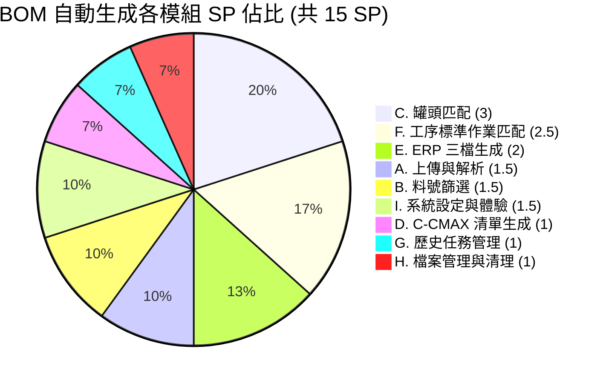
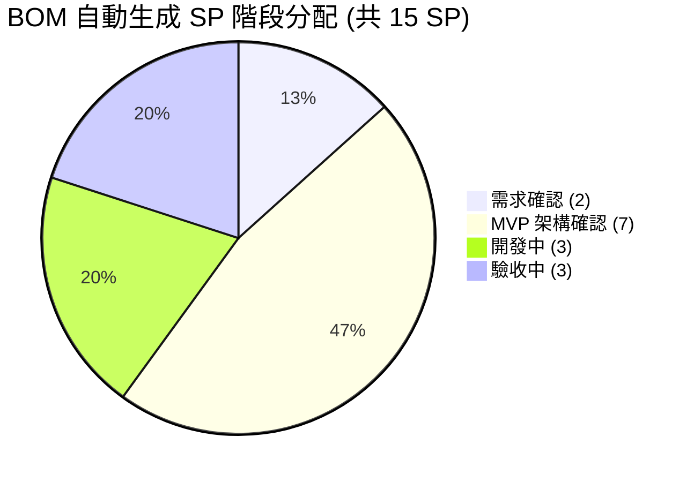

# BOM 表自動生成系統 — 功能模組與 Story Point 規劃書

本文件為《BOM 表自動生成系統（Auto-BOM）》的功能模組劃分、Story Point（SP）估算與目前進度規劃。系統將工程人員的 **BOM 底稿（WXBMR005）** 一鍵轉換為 **C-CMAX 導入清單** 與 **3 份 ERP 上傳檔（pj_bom_loader / routings / sequences）**，核心為「**罐頭自動匹配**」與「**工序標準作業 ID 匹配**」，取代原本逐欄手動填寫。

> 本估算總計 **15 SP**（1 SP = NT$20,000，合計 NT$300,000）。
> 範圍以「5 步驟精靈流程 + 歷史任務管理」為前提；不含「非目標」項目（其他料號系統串接、ERP 直接寫入、多人協作、權限登入）。

---

## 一、技術模組

| 層級 | 技術 |
|------|------|
| **前端框架** | React 19 + TypeScript + Vite + Tailwind CSS 4 |
| **後端框架** | Python + FastAPI + SQLAlchemy |
| **資料庫** | MySQL 8.x（mysql2 / PyMySQL） |
| **Excel 處理** | openpyxl（解析 BOM 底稿 / 罐頭 / 標準作業；產出 4 類 Excel） |
| **作業流程** | 5 步驟精靈（上傳 → 篩選 → 配置罐頭 → 匯出清單 → 生成檔案）＋ 歷史記錄 |
| **多語系** | 簡體中文（預設）／繁體中文／English |
| **檔案管理** | 上傳 / 產出依 task 分目錄；孤兒檔案自動清理 |

---

## 二、核心功能模組（9 大模組）

| 模組 | 複雜度 | 說明 |
|------|--------|------|
| **A. 上傳與 Excel 解析** | 中高 | BOM 底稿 / 罐頭對照表 / 標準作業（WXBMR004）解析，依描述前綴分類焊接 / 成型 / 包裝 |
| **B. 料號篩選** | 中 | 料號去重（料號 + 原件 + 替代結構）、搜尋、多元件多替代結構保留 |
| **C. 罐頭匹配（焊接 / 成型 / 包裝）** | 高 | 焊接按（功能別 + mil）、成型通用、包裝按規則；可視化規則面板 + 逐行覆蓋 |
| **D. C-CMAX 導入清單生成（Phase 1）** | 中 | 料號清單（20 欄）＋ 罐頭（16 欄）兩個工作表 |
| **E. ERP 三檔生成（Phase 2）** | 高 | pj_bom_loader（23 欄）、routings（60 欄）、sequences（99 欄） |
| **F. 工序標準作業 ID 匹配** | 高 | sequences 12 道工序 → WXBMR004 標準作業 ID（家族 / 封裝 / 鍍層 / 晶片規則） |
| **G. 歷史任務管理** | 中 | 任務列表、分頁、下載、刪除（連帶清除關聯檔案） |
| **H. 檔案管理與清理** | 中 | 上傳 / 產出依 task 分目錄、上傳即綁定、孤兒檔案啟動清理 |
| **I. 系統設定與體驗** | 中 | 多語系、可視化下拉元件、欄位篩選、首頁導航、產出表頭格式化 |

---

## 三、功能模組說明與目前進度

> 狀態：✅ 已完成　🔶 主體完成（少數待 USER 規則）　⬜ 待 USER 確認後實作

### A. 上傳與 Excel 解析　✅
| 功能項目 | 狀態 |
|----------|------|
| BOM 底稿（WXBMR005）解析 | ✅ |
| 罐頭對照表解析（依描述前綴分類焊接 / 成型 / 包裝）| ✅ 已修正「無 WAF 跳過」導致 21→18 漏行 |
| 標準作業（WXBMR004）解析 | ✅ |

### B. 料號篩選　✅
| 功能項目 | 狀態 |
|----------|------|
| 料號去重（料號 + 原件 + 替代結構）| ✅ 已修正單欄去重導致 372→174 |
| 搜尋（料號 / 摘要 / TYPE / FAMILY）、全選 | ✅ |
| 替代結構欄位顯示 + 對應說明提示 | ✅ |

### C. 罐頭匹配（焊接 / 成型 / 包裝）　🔶
| 功能項目 | 狀態 |
|----------|------|
| 焊接罐：按（功能別 + mil）匹配 | ✅ 對範本驗證 **174/174 = 100%**（原 WAF 匹配僅 30%）|
| 成型罐：通用套用全部 | ✅ 100% |
| 包裝罐：按規則（R1 / R2 等）匹配 | ✅ 100% |
| 可視化規則面板（條件下拉、套用回填）| ✅ |
| 配置罐頭表：欄位篩選（含「未匹配」）| ✅ |
| 電鍍鍍層厚度 5um / 8um 個案 | 🔶 待 USER 規則（見待確認 ③）|

### D. C-CMAX 導入清單生成（Phase 1）　✅
| 功能項目 | 狀態 |
|----------|------|
| 料號清單 + 罐頭 兩個工作表產出 | ✅ |
| 下載 | ✅ |

### E. ERP 三檔生成（Phase 2）　✅
| 功能項目 | 狀態 |
|----------|------|
| pj_bom_loader / routings / sequences 產出 | ✅ 欄位與客戶範本逐欄一致 |
| 產出表頭格式化（凍結首列、欄寬、底色）| ✅ |
| ERP 數量欄（罐頭行固定 1）| ✅；切割行＝單位用量 ⬜（待確認 ⑤）|

### F. 工序標準作業 ID 匹配　🔶
| 功能項目 | 狀態 |
|----------|------|
| 焊接 / 成型 / 切腳 / Burning / 外包後 / TMTT / FQC（家族規則）| ✅ |
| 電鍍（貝維特 / 佰潤 / 欣捷，封裝規則）| ✅（少數厚度個案待確認）|
| 外包前（通用）| 🔶 規則待確認（見待確認 ②）|
| 切割（晶片規則）| ⬜ 留空，待 USER 晶片對照表（見待確認 ①）|
| 整體驗證 | 排除切割 **11 道工序 99.7%** 命中範本 |

### G. 歷史任務管理　✅
| 功能項目 | 狀態 |
|----------|------|
| 任務列表 / 分頁 / 狀態 | ✅ |
| 下載（C-CMAX / BOM / Routing / Sequence）| ✅ |
| 刪除（二次確認、連帶清除關聯檔案）| ✅ |

### H. 檔案管理與清理　✅
| 功能項目 | 狀態 |
|----------|------|
| 上傳 / 產出依 task_{id} 分目錄 | ✅ |
| 標準作業上傳即綁定任務（刪除連帶清除）| ✅ |
| 孤兒上傳檔案啟動時自動清理 | ✅ |

### I. 系統設定與體驗　✅
| 功能項目 | 狀態 |
|----------|------|
| 多語系（簡 / 繁 / 英）| ✅ |
| 自繪下拉元件（限高滾動、不被裁切）| ✅ |
| 首頁 Logo / 標題點擊回首頁 | ✅ |
| 開發埠對接修正（前後端） | ✅ |

---

## 四、Story Point 分配（共 15 SP）

### 4.1 按功能模組分配

| 模組 | SP | 完成度 |
|------|:--:|--------|
| A. 上傳與 Excel 解析 | 1.5 | ✅ 100% |
| B. 料號篩選 | 1.5 | ✅ 100% |
| C. 罐頭匹配（焊接 / 成型 / 包裝） | 3 | 🔶 95%（電鍍厚度個案待規則）|
| D. C-CMAX 導入清單生成 | 1 | ✅ 100% |
| E. ERP 三檔生成 | 2 | ✅ 100% |
| F. 工序標準作業 ID 匹配 | 2.5 | 🔶 90%（切割晶片表待 USER）|
| G. 歷史任務管理 | 1 | ✅ 100% |
| H. 檔案管理與清理 | 1 | ✅ 100% |
| I. 系統設定與體驗 | 1.5 | ✅ 100% |
| **合計** | **15** | |

### 4.2 按專案階段分配（六大階段）

> 本案為與客戶 **開案** 階段：先前已建置的系統主體列為 **MVP（可展示）**；另保留「開發中」（USER 期望的邏輯調整工時）與「驗收中」（USER 驗收 / UAT 工時）。專案進行中，**已結案為 0**。

| 階段 | SP | 佔比 | 說明 |
|------|:--:|:----:|------|
| 需求確認 | **2** | 13% | 待 USER 確認的 5 項規則：切割晶片對照表、外包前、電鍍 5/8um、欄位順序、ERP 數量＝單位用量；含需求釐清與範例「對答案」 |
| MVP 架構確認 | **7** | 47% | 已建置、可展示的系統主體（9 大模組：上傳解析、料號篩選、罐頭匹配焊接 100%、C-CMAX、ERP 三檔、工序 11 道 99.7%、歷史、檔案、體驗）作為 MVP |
| 開案確認 | **0** | 0% | 與客戶開案：範圍 / 里程碑 / 交付確認（不單列工時，併入驗收中）|
| 開發中 | **3** | 20% | 保留 USER 期望的邏輯調整工時：切割晶片表與各規則套用、以及驗收回饋之邏輯修改 |
| 驗收中 | **3** | 20% | USER 驗收 / UAT、端到端比對客戶範本、部署上線 |
| 已結案 | **0** | 0% | 尚未結案（專案進行中，後續持續調整 / 維運） |
| **合計** | **15** | **100%** | |

> **數字規劃邏輯**：先前已完成、可展示的系統主體列為 **MVP（7 SP）**；保留 **開發中（3 SP）** 給 USER 期望的邏輯調整、**驗收中（3 SP）** 給 USER 驗收 / 上線時間；**需求確認（2 SP）** 為待 USER 回覆的 5 項規則。**開案確認與已結案為 0**（開案不單列工時、專案尚在進行）。

---

## 五、目前完成度總覽（有做／沒做）

**✅ 已完成（可立即使用）**
1. BOM 底稿 / 罐頭 / 標準作業上傳與解析（含罐頭分類、21→18 漏行修正）
2. 料號篩選（去重修正 372、替代結構欄、說明提示）
3. 罐頭自動匹配：**焊接（功能別 + mil）100%**、成型 100%、包裝（R1/R2）100% + 可視化規則面板
4. C-CMAX 導入清單（Phase 1）
5. ERP 三檔生成（Phase 2）＋ 表頭格式化
6. 工序標準作業 ID：**11 道工序 99.7%** 命中範本
7. 歷史任務管理（列表 / 下載 / 刪除）
8. 檔案分目錄 / 孤兒清理 / 上傳即綁定
9. 多語系、UI 元件、首頁導航、埠對接修正

**⬜ 未完成（待 USER 提供規則）**
1. **切割工序晶片對照表**（同 family／原件、不同 TYPE 對到不同晶片，需 USER 對照表）
2. **外包前** 用通用 vs 按封裝
3. **電鍍鍍層厚度** 5um / 8um 個案
4. **上傳檔欄位順序** 是否固定（或改為按表頭名讀取）
5. **ERP 數量** 切割行＝料號清單「單位用量」欄（確認後直接採用）

---

## 六、待 USER 確認事項

> 詳見《罐頭與工序匹配-需USER確認.docx》（含實際畫面與範例）。

| # | 待確認項目 | 影響範圍 | 目前處置 |
|---|-----------|---------|---------|
| 1 | 切割工序晶片碼對照（TYPE → 晶片碼 / 標準作業 ID）| F 工序匹配 | 切割欄暫留空（不亂填）|
| 2 | 外包前：通用 vs 按封裝 | F 工序匹配 | 暫取通用（與範本一致）|
| 3 | 電鍍鍍層厚度 5um / 8um 規則 | C 罐頭 / F 工序 | 暫取 5um（多數）|
| 4 | 上傳檔欄位順序是否固定 | A 解析穩健性 | 暫約定順序不可變 |
| 5 | ERP 數量＝單位用量欄？ | E ERP 生成 | 罐頭行固定 1，切割行待確認 |

---

## 七、交付項目

1. 5 步驟精靈式操作介面（上傳 → 篩選 → 配置罐頭 → 匯出清單 → 生成檔案）
2. BOM 底稿 / 罐頭 / 標準作業上傳與解析（含分類與漏行修正）
3. 料號篩選（料號 + 原件 + 替代結構去重）
4. 罐頭自動匹配（焊接功能別 + mil、成型、包裝規則）＋ 可視化規則面板與欄位篩選
5. C-CMAX 導入清單（Phase 1，2 工作表）
6. ERP 三檔生成（pj_bom_loader / routings / sequences，欄位對齊範本、表頭格式化）
7. 工序標準作業 ID 匹配引擎（11 道工序 99.7%，切割待規則）
8. 歷史任務管理（列表 / 下載 / 刪除 / 分頁）
9. 檔案管理（分目錄 / 綁定 / 孤兒清理）與多語系、UI 體驗
10. USER 確認文件（含系統畫面與待確認問題）

---

*估算日期：2026-06-25　|　總計 15 SP（NT$300,000）　|　MVP 主體已建置，與客戶開案中*
