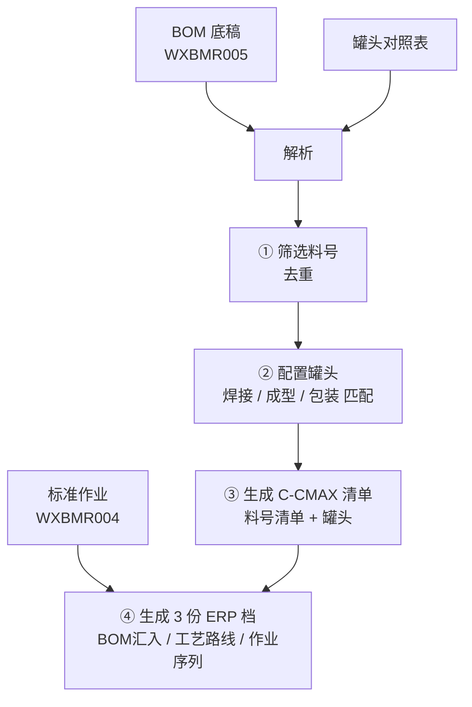
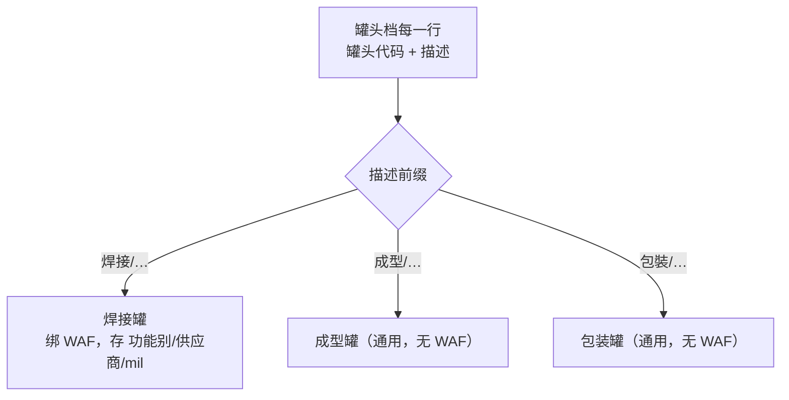
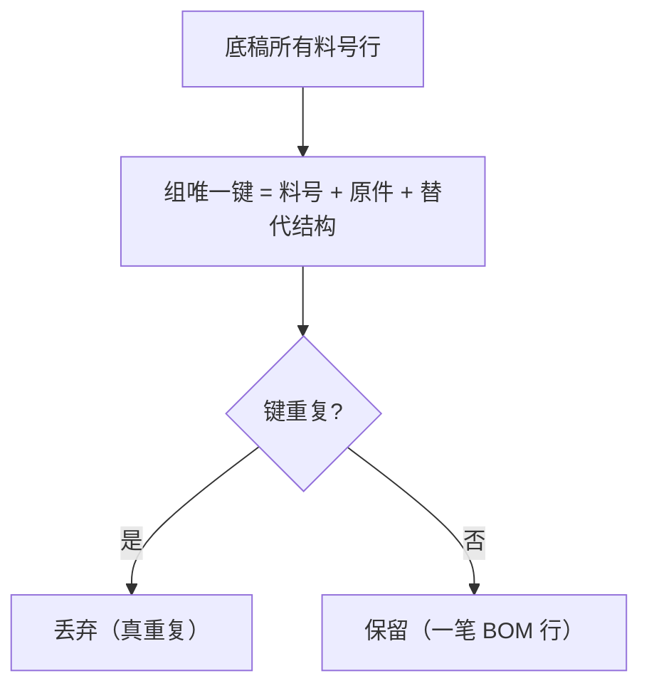
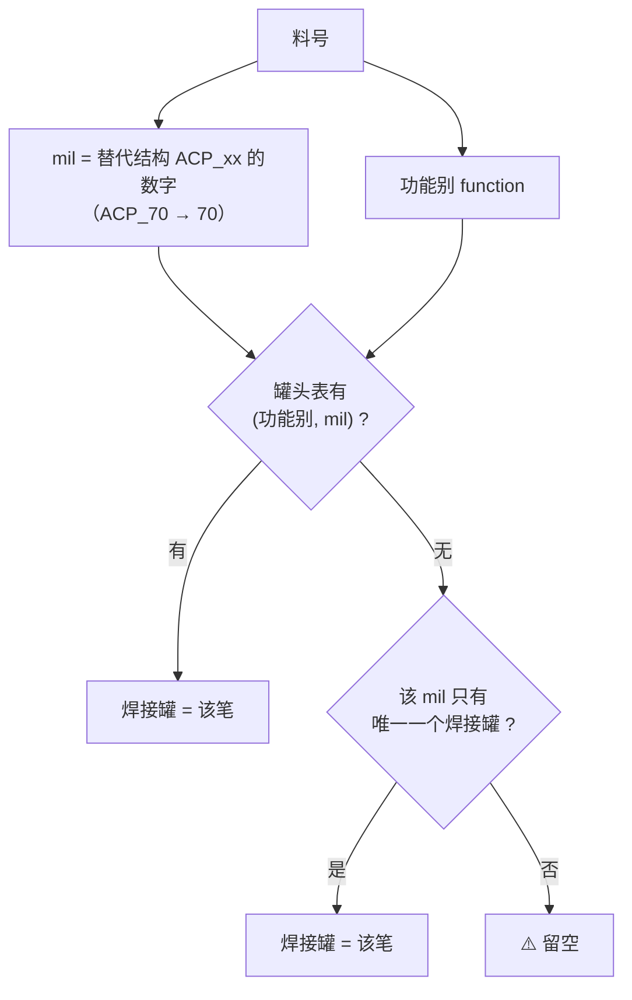
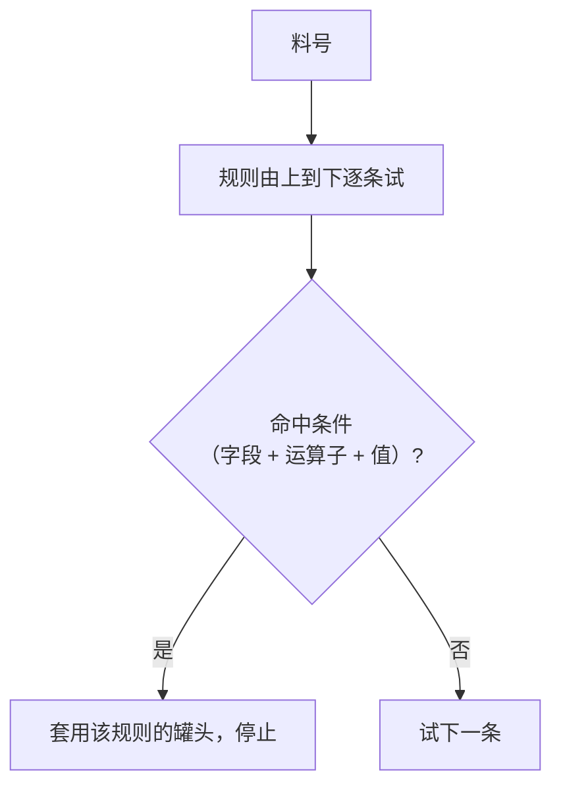
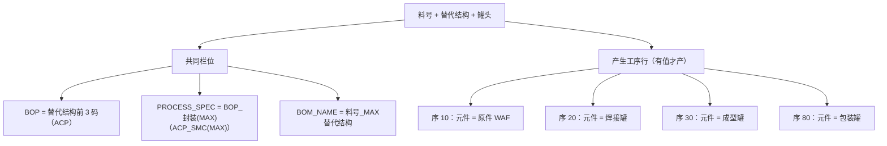
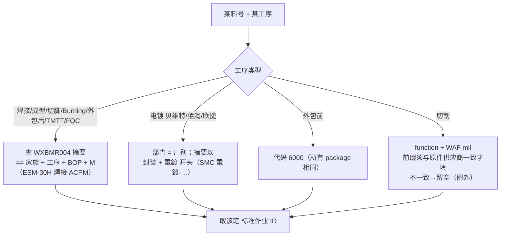

# BOM 自动生成系统 — 现行 Mapping 规则与流程（供核对）

> 本文件把系统**目前实际在跑的转换逻辑**逐步拆开，供与客户核对「现况是否正确、有无逻辑误差」。
> 每一步：流程图 + 精确的栏位对应规则。⚠️ 標記＝目前留空或待客户确认之处。
>
> 更新日期：2026-06-25　｜　依现行程式码整理（非理想版）

---

## 〇、全流程总览

| 步骤 | 输入 | 输出 |
|------|------|------|
| 解析 | BOM 底稿 / 罐头 / 标准作业 | 结构化料号、罐头、工序资料 |
| ① 筛选 | 底稿料号 | 去重后的料号行 |
| ② 配置罐头 | 料号 + 罐头档 | 每料号带焊接 / 成型 / 包装罐 |
| ③ C-CMAX 清单 | 料号 + 罐头 | 料号清单 + 罐头 两工作表 |
| ④ ERP 三档 | 料号 + 罐头 + 标准作业 | BOM汇入 / 工艺路线 / 作业序列 |

---

## 一、上传与解析规则

### 1.1 BOM 底稿（WXBMR005）→ 料号栏位（按栏位位置读取）

| 栏 | 栏位 | 栏 | 栏位 |
|----|------|----|------|
| 1 | 料号 | 9 | FAMILY |
| 2 | 摘要 | 10 | PACKAGE |
| 3 | 内规文件编号 | 11 | LINE |
| 4 | 大分类 | 12 | FUNCTION（功能别 SKY/SUPER…）|
| 5 | 中分类 | 13 | 料号序号 |
| 6 | 替代结构（ACP_xx）| 14 | 原件（WAF code）|
| 7 | BOM 附注 | 15 | 原件摘要 |
| 8 | TYPE | | |

> ⚠️ **按栏位「位置」读取，非按表头名**——栏位若移动/增删会读错且不报错（待确认项 4）。

### 1.2 罐头对照表 → 分类为 焊接 / 成型 / 包装

- 焊接罐：一行一个，绑该行 WAF；同时存 功能别、供应商、mil。
- 成型 / 包装罐：无 WAF，存为「通用罐头」候选。

### 1.3 标准作业（WXBMR004）→ 工序对照

| 栏 | 用途 |
|----|------|
| 1 | 标准作业 ID |
| 3 | 摘要（产品码，如「ESM-30H 焊接 ACPM」「ERG EGPP-70」）|
| 4 | 部门（＝工序：切割/焊接/成型/…/贝维特/佰润…）|
| 6 | 子序号（10/20/30，非 12 道工序号）|

---

## 二、筛选去重规则

- **唯一键 = 料号 ＋ 原件(WAF) ＋ 替代结构**。
- 同料号可有多个原件、同原件可有多个替代结构，各算一笔（皆保留）。

---

## 三、罐头匹配规则（配置罐头）

### 3.1 焊接罐 — 按（功能别 + mil）

- **关键：焊接罐不是按原件 WAF，而是按（功能别 + mil）**。mil 来自替代结构 ACP_xx 的数字。
- 同 mil 多个 WAF 共用同一焊接罐；84mil 的 EURG84/SKY84 靠功能别区分。
- 对客户范本验证：**174/174 = 100%**。

### 3.2 成型罐 / 包装罐 — 按规则面板

- 预设规则：
  - **成型罐**：「全部 → 单一通用成型罐（SMC_MD0015）」。
  - **包装罐**：「料号含 `_R1_` → PA0009」「料号含 `_R2_` → PA0011」。
- 可在面板增删/改条件（料号/TYPE/FAMILY/PACKAGE/原件；包含/等于/正则/全部）。
- 对客户范本验证：成型 100%、包装 100%。

> 使用者可在配置罐头表**逐行手动覆盖**任何罐头（已修正：手动修改会存回，生成时采用）。

---

## 四、C-CMAX 清单生成规则（③）

### 4.1 料号清单（20 栏，逐料号一行）

| 栏位 | 来源 / 规则 |
|------|------------|
| 料号 / 摘要 / TYPE / FAMILY / PACKAGE / LINE / FUNCTION / 原件 / 原件摘要 | 直接取底稿对应栏 |
| 替代结构 | 底稿替代结构（ACP_xx）|
| **MAX 替代结构** | 替代结构 **加尾码 M**（ACP_70 → ACP_70M）|
| 晶片供应商 / Wafer Type | 由「原件摘要」拆解 |
| 单位用量 / 原件生效时间 | 取底稿对应栏（⚠️ 目前多为空）|

### 4.2 罐头（16 栏，逐「不重复原件」一行）

- 由「原件摘要」拆出：供应商、晶圆尺寸、Wafer Type、mil、厚度、金属层、附注。
- 焊接 / 成型 / 包装罐代码与描述带入。

---

## 五、ERP 三档生成规则（④）

### 5.1 BOM 汇入（pj_bom_loader）— 每料号最多 4 行

- 每行：数量 = 1、良品率 = 1、BOP / PROCESS_SPEC / BOM_NAME 如上。
- ⚠️ **数量目前固定 1**；范本切割（晶片）行应为「单位耗用量」（0/1 不等）——待确认项 5。
- 某罐头为空则跳过该行。

### 5.2 工艺路线（routings）— 每「料号 + MAX替代结构」一行

- 替代结构 = MAX替代结构；组织代码 = `WX1`；ROUTING_TYPE = 1；PROCESS_FLAG = 1；交易类型 = `CREATE`；DEMAND_SOURCE_TYPE = 0。（其余栏位留白，由 ERP 填）

### 5.3 作业序列（sequences）— 每料号 12 道工序

固定 12 道工序：`10切割 · 20焊接 · 30成型 · 40切脚 · 50Burning · 60外包前 · 61贝维特 · 63佰润 · 68欣捷 · 70外包后 · 80TMTT · 90FQC`

**每道工序的「标准作业 ID」匹配规则：**

> 切割 / 外包前规则已由**客户确认**（2026-06-25）：切割＝WAF mil＋function；外包前＝所有 package 用代码 6000。

| 工序组 | 匹配规则（现行）| 验证 |
|--------|----------------|------|
| 焊接/成型/切脚/Burning/外包后/TMTT/FQC | 摘要 = `{家族} {工序} {BOP}M` | ✅ 100% |
| 电镀（贝维特/佰润/欣捷）| 部门=厂别、摘要以 `{封装} 電鍍` 开头 | 🔶 大多对（⚠️ 5um/8um 个案，如 MURC3J 需 8um，待确认项 3）|
| 外包前 | **所有 package 用代码 6000**（客户确认）| ✅ 100% |
| 切割 | **function + WAF mil**；前缀须与原件供应商一致才填，否则**留空**（客户确认）| 🔶 正确 162 / 留空 19 / **错误 0**（约 89.5%）；19 笔例外见附件 |

- 其余固定栏：组织代码 `WX1`、部门代码 = 工序名、PROCESS_FLAG=1、交易类型 `CREATE`、REFERENCE_FLAG=1。
- 切割 19 笔例外（function+mil 无法唯一判定的 TYPE，如 FR3/UF 系列）→ 详见《切割工序-例外待客户确认.docx》。

---

## 六、需与客户核对的重点（可能有逻辑误差处）

| # | 环节 | 现行做法 | 请客户确认 |
|---|------|---------|-----------|
| 1 | 切割 标准作业 | function + WAF mil（前缀须与原件供应商一致才填，否则留空）| **19 笔例外**如何判定（TYPE→晶片码？）见《切割工序-例外待客户确认.docx》|
| 2 | 外包前 | 所有 package 用代码 6000 | 确认「一律 6000」正确 |
| 3 | 电镀厚度 | 取到的第一个（多为 5um）| 哪些料号用 8um（如 MURC3J）|
| 4 | 上传档栏位 | 按位置读取 | 栏位顺序/数量是否固定不变 |
| 5 | BOM汇入 数量 | 固定 1 | 切割（晶片）行是否＝料号清单「单位用量」（0/1 不等）|
| 6 | 焊接匹配键 | 功能别 + mil（非 WAF）| 确认此逻辑正确（范本 100%）|
| 7 | MAX 替代结构 | 替代结构 + 尾码 M | 确认规则正确 |
| 8 | BOP / PROCESS_SPEC | 替代结构前 3 码 / `BOP_封装(MAX)` | 确认规则正确 |

> 建议核对方式：拿几笔实际料号，逐栏对照本文件规则与客户范本。
> 第 1（切割例外）、3（电镀 8um）为客户仍需补规则处；第 2（外包前）为客户已确认；第 4~8 为已实作请确认无误。
