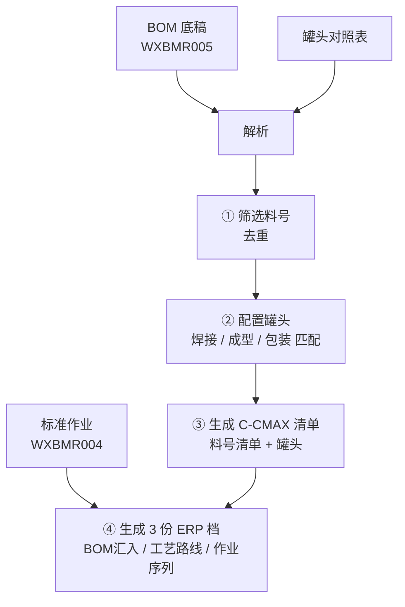
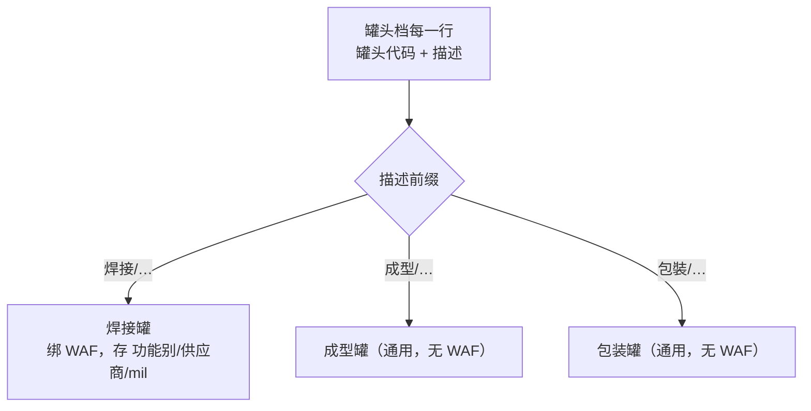
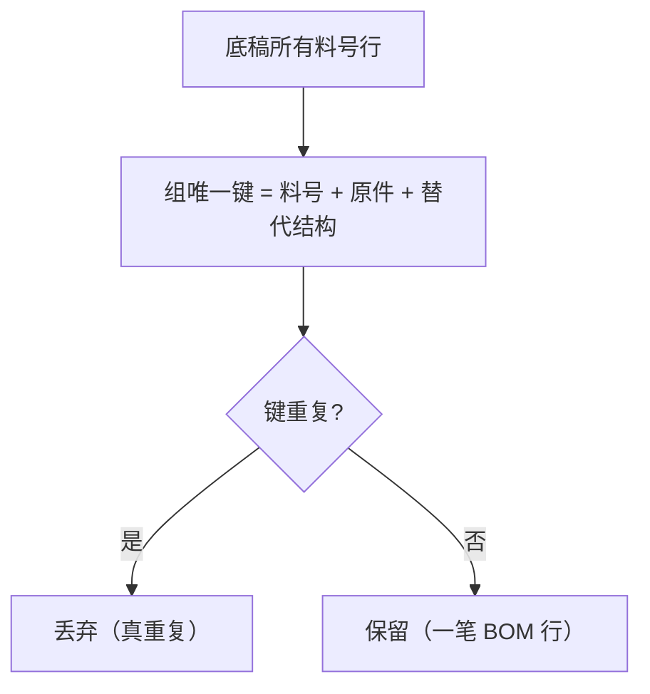
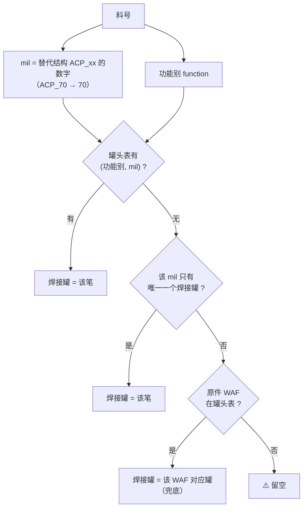
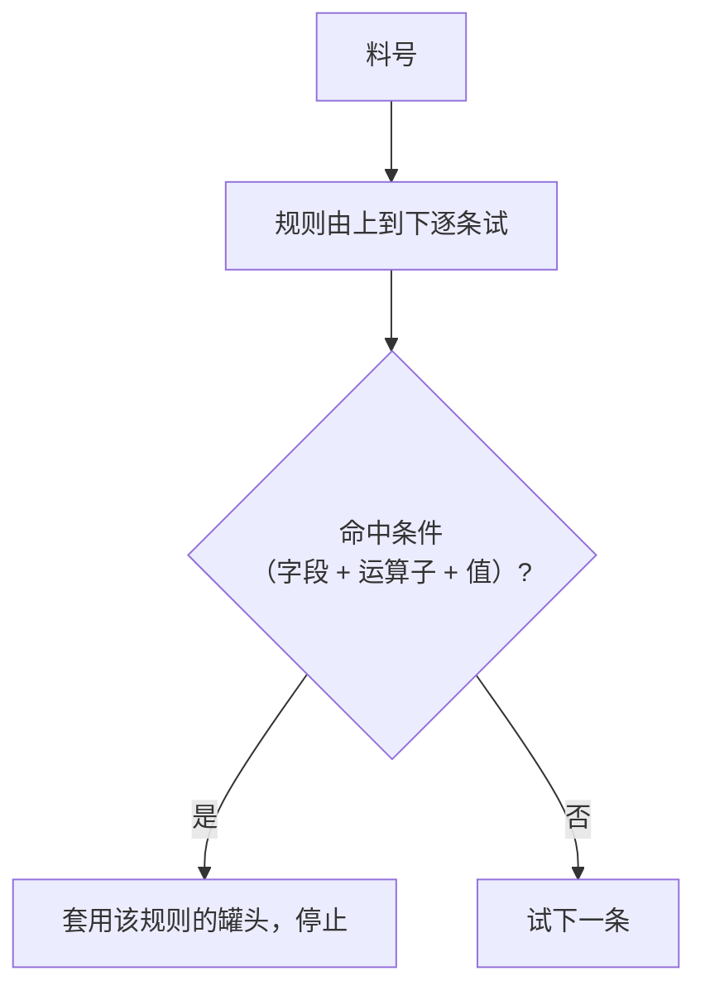
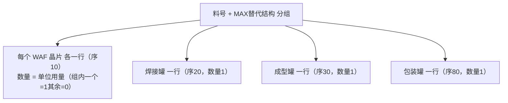
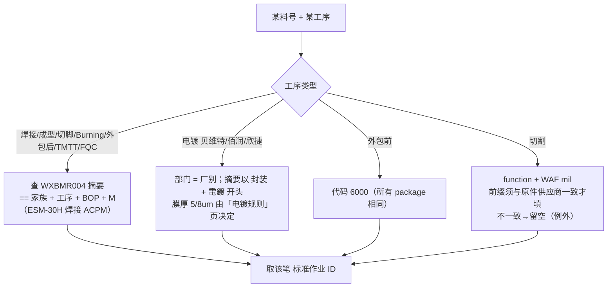

# BOM 自动生成系统 — 现行 Mapping 规则与流程（供核对）

> 本文件把系统**目前实际在跑的转换逻辑**逐步拆开，供与客户核对「现况是否正确、有无逻辑误差」。
> 每一步：流程图 + 精确的栏位对应规则。⚠️ 標記＝目前留空或待客户确认之处。
>
> 更新日期：2026-06-25　｜　依现行程式码整理（非理想版）

---

## 〇、全流程总览

```mermaid
flowchart TD
    B["BOM 底稿<br/>WXBMR005"] --> P0["解析"]
    C["罐头对照表"] --> P0
    P0 --> S1["① 筛选料号<br/>去重"]
    S1 --> S2["② 配置罐头<br/>焊接 / 成型 / 包装 匹配"]
    S2 --> S3["③ 生成 C-CMAX 清单<br/>料号清单 + 罐头"]
    STD["标准作业<br/>WXBMR004"] --> S4
    S3 --> S4["④ 生成 3 份 ERP 档<br/>BOM汇入 / 工艺路线 / 作业序列"]
```

| 步骤 | 输入 | 输出 |
|------|------|------|
| 解析 | BOM 底稿 / 罐头 / 标准作业 | 结构化料号、罐头、工序资料 |
| ① 筛选 | 底稿料号 | 去重后的料号行 |
| ② 配置罐头 | 料号 + 罐头档 | 每料号带焊接 / 成型 / 包装罐 |
| ③ C-CMAX 清单 | 料号 + 罐头 | 料号清单 + 罐头 两工作表 |
| ④ ERP 三档 | 料号 + 罐头 + 标准作业 | BOM汇入 / 工艺路线 / 作业序列 |

---

## 一、上传与解析规则

### 1.1 BOM 底稿（WXBMR005）→ 料号栏位（按栏位位置读取）

| 栏 | 栏位 | 栏 | 栏位 |
|----|------|----|------|
| 1 | 料号 | 9 | FAMILY |
| 2 | 摘要 | 10 | PACKAGE |
| 3 | 内规文件编号 | 11 | LINE |
| 4 | 大分类 | 12 | FUNCTION（功能别 SKY/SUPER…）|
| 5 | 中分类 | 13 | 料号序号 |
| 6 | 替代结构（ACP_xx）| 14 | 原件（WAF code）|
| 7 | BOM 附注 | 15 | 原件摘要 |
| 8 | TYPE | | |

> ⚠️ **按栏位「位置」读取，非按表头名**——栏位若移动/增删会读错且不报错（待确认项 4）。

### 1.2 罐头对照表 → 分类为 焊接 / 成型 / 包装

```mermaid
flowchart TD
    R["罐头档每一行<br/>罐头代码 + 描述"] --> T{"描述前缀"}
    T -- "焊接/…" --> W["焊接罐<br/>绑 WAF，存 功能别/供应商/mil"]
    T -- "成型/…" --> M["成型罐（通用，无 WAF）"]
    T -- "包裝/…" --> P["包装罐（通用，无 WAF）"]
```

- 焊接罐：一行一个，绑该行 WAF；同时存 功能别、供应商、mil。
- 成型 / 包装罐：无 WAF，存为「通用罐头」候选。

### 1.3 标准作业（WXBMR004）→ 工序对照

| 栏 | 用途 |
|----|------|
| 1 | 标准作业 ID |
| 3 | 摘要（产品码，如「ESM-30H 焊接 ACPM」「ERG EGPP-70」）|
| 4 | 部门（＝工序：切割/焊接/成型/…/贝维特/佰润…）|
| 6 | 子序号（10/20/30，非 12 道工序号）|

---

## 二、筛选去重规则

```mermaid
flowchart TD
    A["底稿所有料号行"] --> K["组唯一键 = 料号 + 原件 + 替代结构"]
    K --> D{"键重复?"}
    D -- 是 --> X["丢弃（真重复）"]
    D -- 否 --> Y["保留（一笔 BOM 行）"]
```

- **唯一键 = 料号 ＋ 原件(WAF) ＋ 替代结构**。
- 同料号可有多个原件、同原件可有多个替代结构，各算一笔（皆保留）。

---

## 三、罐头匹配规则（配置罐头）

### 3.1 焊接罐 — 按（功能别 + mil），WAF 兜底

```mermaid
flowchart TD
    I["料号"] --> MIL["mil = 替代结构 ACP_xx 的数字<br/>（ACP_70 → 70）"]
    I --> FUN["功能别 function"]
    MIL --> Q{"罐头表有<br/>(功能别, mil) ?"}
    FUN --> Q
    Q -- 有 --> R1["焊接罐 = 该笔"]
    Q -- 无 --> Q2{"该 mil 只有<br/>唯一一个焊接罐 ?"}
    Q2 -- 是 --> R2["焊接罐 = 该笔"]
    Q2 -- 否 --> Q3{"原件 WAF<br/>在罐头表 ?"}
    Q3 -- 是 --> R4["焊接罐 = 该 WAF 对应罐<br/>（兜底）"]
    Q3 -- 否 --> R3["⚠️ 留空"]
```

- **主键 = 功能别 + mil**（mil 来自替代结构 ACP_xx 的数字），**不是按原件 WAF**。
  - 依据：客户 3-3 正解中，同一料号可有多个替代结构分支（如 MB520 的 ACP_68M / ACP_72M），
    **焊接罐跟着「分支的 mil」走**，而非跟着 WAF。例如 ACP_68M 分支即使主料是 72mil 的 WAF110633，
    焊接罐仍是 68mil 的 DW0164（不是 WAF110633 自己的 DW0166）。
- 同 mil 多个 WAF 共用同一焊接罐；84mil 的 EURG84/SKY84 靠功能别区分。
- **WAF 兜底（新增，2026-07-28）**：当罐头档的 function/mil 标示与料号对不上时，改用原件 WAF 精确匹配。
  典型案例 MOS：料号 FUNCTION=MOSFET / mil 128，罐头却是 FUNCTION=MOS / mil 102.35，两边标示不一致，
  但原件 WAF110725 与罐头 WAF 一致 → 靠 WAF 命中 DFN3333S-8L_DW0001。
- **package 隔离（新增，2026-07-28）**：上传新罐头时**清空整张 CanTemplate**（一案一份罐头），
  避免 SMC/SMB/MOS 罐头混在同库、令 SMB 料号误配到 SMC 焊接罐。
- 验证：客户范本 174/174 = 100%；SMB/MOS/SMC 7-22 三个测试档关键案例全数正确；3-3 回归 0 分歧。

### 3.2 成型罐 / 包装罐 — 按规则面板

```mermaid
flowchart TD
    I["料号"] --> RULE["规则由上到下逐条试"]
    RULE --> H{"命中条件<br/>（字段 + 运算子 + 值）?"}
    H -- 是 --> A["套用该规则的罐头，停止"]
    H -- 否 --> N["试下一条"]
```

- 预设规则：
  - **成型罐**：单一 → 「全部套用」；多个 → 第一个「全部」，其余需条件。
  - **包装罐**：**单一 → 「全部套用」**（新增修正，2026-07-28）；两个 → 「料号含 `_R1_` → PA0009」「含 `_R2_` → PA0011」。
- 可在面板增删/改条件（料号/TYPE/FAMILY/PACKAGE/原件；包含/等于/正则/全部）。
- 对客户范本验证：成型 100%、包装 100%。

> **修正（2026-07-28）**：先前「只放一个包装罐时无法辨识」——因单一包装罐仍种子化成 `包含 ""`（空值永不命中）。
> 已改为单一包装罐直接 `全部套用`（对齐成型罐逻辑）。MOS 测试档（仅 1 个包装罐 PA0001）已可正确套用到全部。

> 使用者可在配置罐头表**逐行手动覆盖**任何罐头（已修正：手动修改会存回，生成时采用）。

---

## 四、C-CMAX 清单生成规则（③）

### 4.1 料号清单（20 栏，逐料号一行）

| 栏位 | 来源 / 规则 |
|------|------------|
| 料号 / 摘要 / TYPE / FAMILY / PACKAGE / LINE / FUNCTION / 原件 / 原件摘要 | 直接取底稿对应栏 |
| 替代结构 | 底稿替代结构（ACP_xx）|
| **MAX 替代结构** | 替代结构 **加尾码 M**（ACP_70 → ACP_70M）|
| 晶片供应商 / Wafer Type | 由「原件摘要」拆解 |
| 单位用量 / 原件生效时间 | 取底稿对应栏（⚠️ 目前多为空）|

### 4.2 罐头（16 栏，逐「不重复原件」一行）

- 由「原件摘要」拆出：供应商、晶圆尺寸、Wafer Type、mil、厚度、金属层、附注。
- 焊接 / 成型 / 包装罐代码与描述带入。

---

## 五、ERP 三档生成规则（④）

### 5.1 BOM 汇入（pj_bom_loader）— 按「料号 + MAX替代结构」分组

> 客户规则（2026-06-25）：同一料号+替代结构若有**多个 WAF 晶片，各列一行**；**焊接/成型/包装罐各只列一次**；数量「保留单位用量其一=1，其余=0」。

```mermaid
flowchart TD
    G["料号 + MAX替代结构 分组"] --> W["每个 WAF 晶片 各一行（序10）<br/>数量 = 单位用量（组内一个=1其余=0）"]
    G --> C20["焊接罐 一行（序20，数量1）"]
    G --> C30["成型罐 一行（序30，数量1）"]
    G --> C80["包装罐 一行（序80，数量1）"]
```

- 共同栏：BOP = 替代结构前 3 码；PROCESS_SPEC = `BOP_封装(MAX)`；BOM_NAME = `料号_MAX替代结构`；良品率 = 1。
- **数量**：晶片行 = **单位用量**（料号清单 col19，日期编码：`datetime→1`、`time→0`）；罐头行固定 1。
- 某罐头为空则跳过该行。

### 5.2 工艺路线（routings）— 每「料号 + MAX替代结构」一行

- 替代结构 = MAX替代结构；组织代码 = `WX1`；ROUTING_TYPE = 1；PROCESS_FLAG = 1；交易类型 = `CREATE`；DEMAND_SOURCE_TYPE = 0。（其余栏位留白，由 ERP 填）

### 5.3 作业序列（sequences）— 每料号 12 道工序

固定 12 道工序：`10切割 · 20焊接 · 30成型 · 40切脚 · 50Burning · 60外包前 · 61贝维特 · 63佰润 · 68欣捷 · 70外包后 · 80TMTT · 90FQC`

**每道工序的「标准作业 ID」匹配规则：**

```mermaid
flowchart TD
    W["某料号 + 某工序"] --> T{"工序类型"}
    T -- "焊接/成型/切脚/Burning/外包后/TMTT/FQC" --> A["查 WXBMR004 摘要<br/>== 家族 + 工序 + BOP + M<br/>（ESM-30H 焊接 ACPM）"]
    T -- "电镀 贝维特/佰润/欣捷" --> B["部门 = 厂别；摘要以 封装 + 電鍍 开头<br/>膜厚 5/8um 由「电镀规则」页决定"]
    T -- "外包前" --> C["代码 6000（所有 package 相同）"]
    T -- "切割" --> D["function + WAF mil<br/>前缀须与原件供应商一致才填<br/>不一致→留空（例外）"]
    A --> E["取该笔 标准作业 ID"]
    B --> E
    C --> E
    D --> E
```

> 切割 / 外包前规则已由**客户确认**（2026-06-25）：切割＝WAF mil＋function；外包前＝所有 package 用代码 6000。

| 工序组 | 匹配规则（现行）| 验证 |
|--------|----------------|------|
| 焊接/成型/切脚/Burning/外包后/TMTT/FQC | 摘要 = `{家族} {工序} {BOP}M` | ✅ 100% |
| 电镀（贝维特/佰润/欣捷）| 部门=厂别、摘要以 `{封装} 電鍍` 开头；**膜厚 5/8um 由「电镀规则」页决定** | ✅ 100%（客户 8um 规则 C002/F014/S021/-AU 已实作）|
| 外包前 | **所有 package 用代码 6000**（客户确认）| ✅ 100% |
| 切割 | **function + WAF mil**；前缀须与原件供应商一致才填，否则**留空**（客户确认）| 🔶 正确 162 / 留空 19 / **错误 0**（约 89.5%）；19 笔例外见附件 |

- 其余固定栏：组织代码 `WX1`、部门代码 = 工序名、PROCESS_FLAG=1、交易类型 `CREATE`、REFERENCE_FLAG=1。
- 切割 19 笔例外（function+mil 无法唯一判定的 TYPE，如 FR3/UF 系列）→ 详见《切割工序-例外待客户确认.docx》。

---

## 六、需与客户核对的重点（可能有逻辑误差处）

| # | 环节 | 现行做法 | 请客户确认 |
|---|------|---------|-----------|
| 1 | 切割 标准作业 | function + WAF mil（前缀须与原件供应商一致才填，否则留空）| **19 笔例外**如何判定（TYPE→晶片码？）见《切割工序-例外待客户确认.docx》|
| 2 | 外包前 | 所有 package 用代码 6000 | 确认「一律 6000」正确 |
| 3 | 电镀厚度 | ✅ 已做：可配置「电镀规则」（摘要/料号 包含关键字 → 8um）；客户 C002/F014/S021/-AU 已内置，范本 100% | 确认 8um 关键字清单是否完整 |
| 4 | 上传档栏位 | ✅ 已改为**按表头名称读取**（header-driven）：栏位顺序/数量改变也不会读错，同时支援旧模板与**固定模板 7-23**；罐头亦支援固定模板「焊接/成型/包装三并排」新版面 | 确认固定模板 7-23 表头名称即为定案 |
| 5 | BOM汇入 数量 | ✅ 已做：晶片行＝单位用量（组内一个=1其余=0）、罐头行=1、多晶片各列一行罐头列一次 | 确认结构与数量正确 |
| 6 | 焊接匹配键 | 功能别 + mil 为主；标示对不上时用原件 WAF 兜底；上传新罐头清空旧库（一案一份）| 确认此逻辑正确（范本 100%、SMB/MOS/SMC 7-22 已修正）|
| 7 | MAX 替代结构 | 替代结构 + 尾码 M | 确认规则正确 |
| 8 | BOP / PROCESS_SPEC | 替代结构前 3 码 / `BOP_封装(MAX)` | 确认规则正确 |
| 9 | **二极体焊接罐缺档** | SMC 7-22 的 TVS 料号（1.5SMCJ58CA、1.5SMCJ18A-AU）正解焊接罐＝`DO201AE_DW0016`，但**该罐不在所附罐头档内** | 罐头档是否应包含二极体（DO201AE）焊接罐？请补齐或说明来源 |

> 建议核对方式：拿几笔实际料号，逐栏对照本文件规则与客户范本。
> 第 1（切割例外）为客户仍需补规则处；第 2（外包前）、3（电镀 8um）为客户已确认并实作；第 4~8 为已实作请确认无误；
> 第 9（二极体焊接罐）为**罐头档缺档**，非逻辑问题——新旧逻辑皆无法配（罐头档没有该罐），需客户补档。
