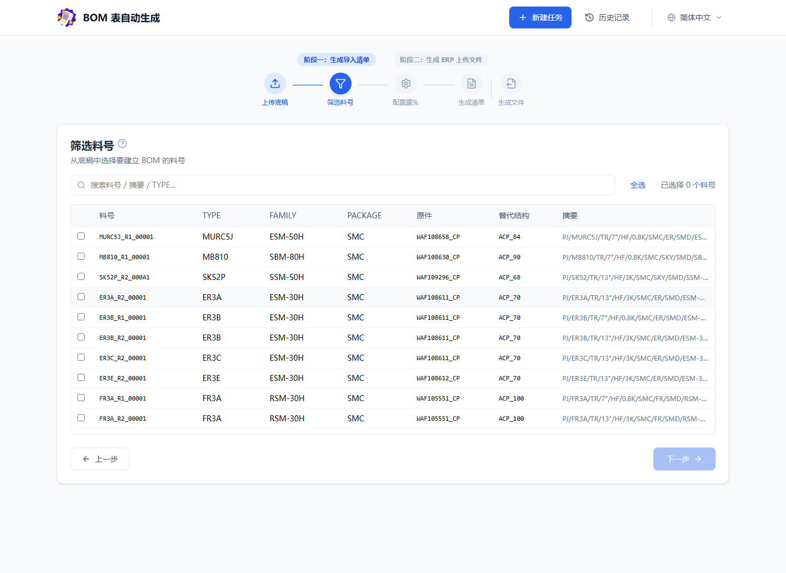
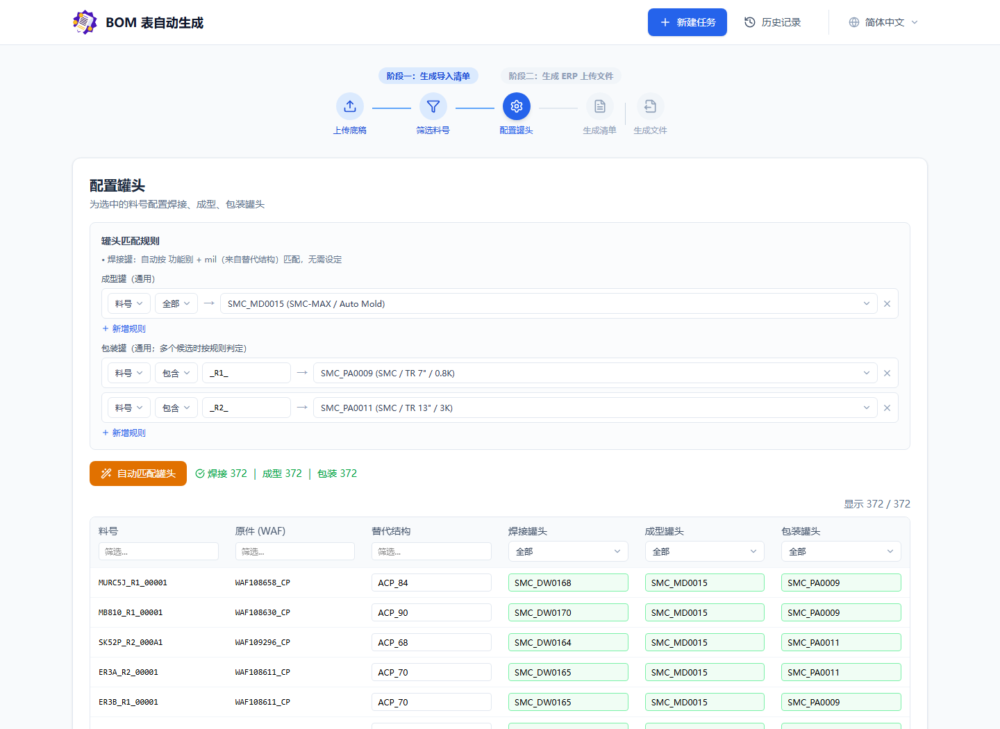
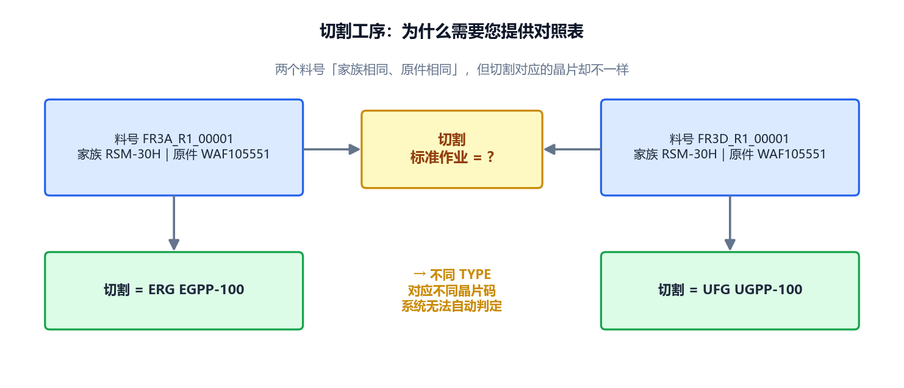
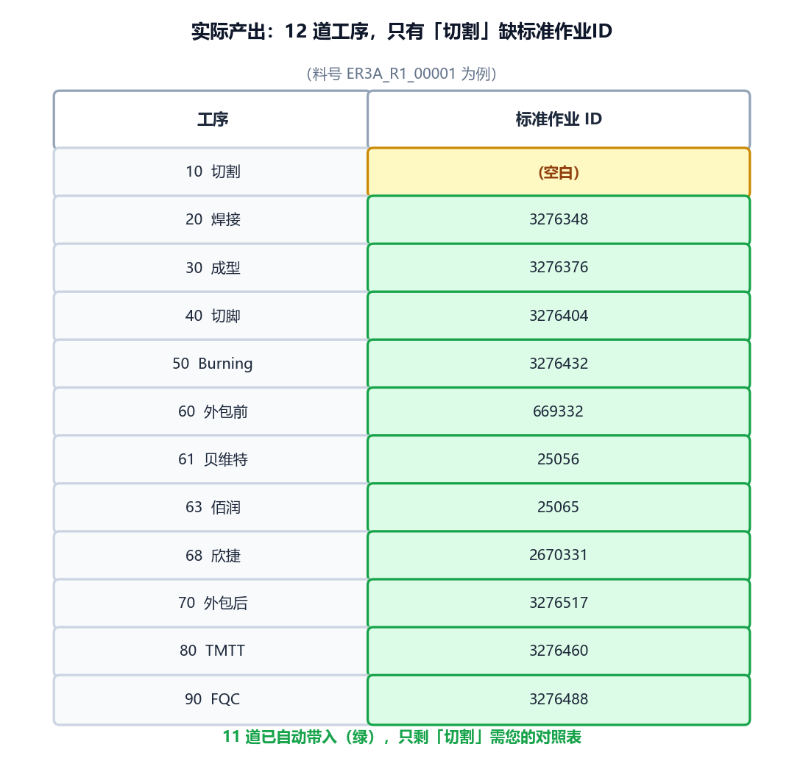
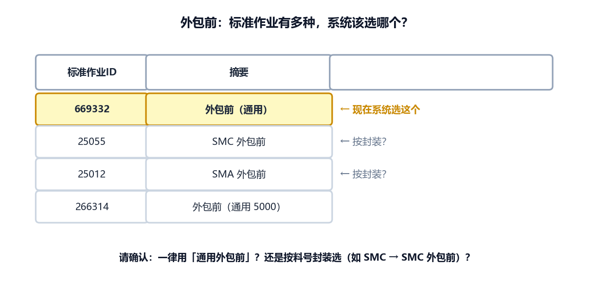
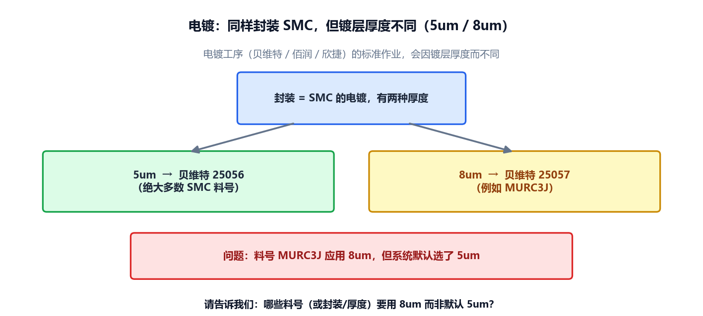
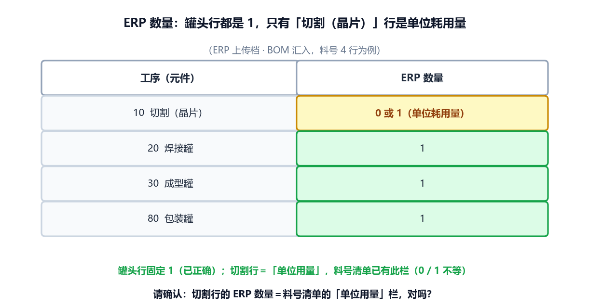

# BOM 自动生成 — 流程说明与待确认事项

> 给需求方（USER）确认用。本文件只列出**目前的作业流程（含系统实际画面）**与**仍需您确认的规则**，已完成的部分不赘述。
> 请直接在每项的「请填 / 请确认」处回复。

---

## 一、整体作业流程（6 步）

```
① 上传底稿+罐头 → ② 筛选料号 → ③ 配置罐头 → ④ 生成C-CMAX清单 → ⑤ 上传标准作业 → ⑥ 生成3份ERP档
```

下面是系统实际画面。

### 步骤 ① 上传 BOM 底稿 + 罐头对照表


### 步骤 ② 筛选料号

从底稿选择要建立 BOM 的料号（含 TYPE / FAMILY / 原件 / 替代结构）。



### 步骤 ③ 配置罐头（自动匹配焊接 / 成型 / 包装）

点「自动匹配罐头」后，系统自动带入三类罐头（下图：**焊接 372 ｜ 成型 372 ｜ 包装 372** 全数带入，绿色表示已匹配）。



> 之后步骤 ④⑤⑥ 产出 C-CMAX 导入清单与 3 份 ERP 上传档（BOM 汇入 / 工艺路线 / 作业序列）。

---

## 二、目前匹配状态

| 项目 | 状态 |
|------|------|
| 焊接罐 / 成型罐 / 包装罐（步骤③）| ✅ 已可自动带入 |
| 工序：焊接 / 成型 / 切脚 / Burning / 外包后 / TMTT / FQC | ✅ 已可自动带入 |
| 工序：电镀（贝维特 / 佰润 / 欣捷）| ✅ 已可自动带入（少数个案待确认）|
| 工序：**切割** | ❓ 待确认（见下方 1️⃣）|
| 工序：**外包前** | ❓ 待确认（见下方 2️⃣）|

---

## 三、需要 USER 确认的事项

### 1️⃣ 切割工序的「标准作业 ID」对照规则 ⭐ 最重要

切割工序要带入的标准作业，似乎与**晶片型号**有关，但目前无法从料号自动判定：



实际产出里，12 道工序只有「切割」这一栏带不出来（黄色＝空白，绿色＝已自动带入）：



**请提供**：一份「**TYPE（或料号）→ 切割晶片码 / 标准作业ID**」的对照表。
> 例：`FR3A → ERG EGPP-100`、`FR3D → UFG UGPP-100`、`ER3A → ERG EGPP-70` …
>
> 请填：________________________________

---

### 2️⃣ 外包前工序用「通用」还是「按封装」？

WXBMR004 里「外包前」有多种：通用的 `外包前`，以及按封装的 `SMA 外包前`、`SMC 外包前` …。目前系统取**通用外包前**。



- [ ] 一律用「通用外包前」
- [ ] 应按封装选（例如 SMC 料号 → `SMC 外包前`）
- [ ] 其他规则：________________________________

---

### 3️⃣ 电镀工序：镀层厚度 5um / 8um

电镀（贝维特 / 佰润 / 欣捷）会因**镀层厚度**对到不同的标准作业。多数 SMC 料号用 5um，但少数（如 MURC3J）用 8um，系统目前默认选 5um。



**请告诉我们**：哪些料号（或封装 / 条件）要用 8um 而非默认 5um？

> 请填 / 附件：________________________________

---

### 4️⃣ 上传 Excel 的栏位顺序是否固定？

系统目前**按栏位位置**读取上传档（BOM底稿 / 罐头 / 标准作业）。
若某栏被移动、或中间增删栏位，会读到错误数据**且不会报错**。

- [ ] 保证每次上传档的栏位顺序与数量都与范本一致（不移动 / 不增删）
- [ ] 不能保证 → 需改为「按表头名称」读取（请提供每栏标准表头名，且表头不可改名）

> 请填：________________________________

---

### 5️⃣ ERP 上传档（BOM 汇入）的「数量」栏

焊接 / 成型 / 包装罐的数量都是 1（已正确）；只有**切割（晶片）那一行**是「单位耗用量」，会是 0 或 1 不等。料号清单里已有「单位用量」栏。



- [ ] 确认：切割行的 ERP 数量 ＝ 料号清单的「单位用量」栏（我们直接采用此栏）
- [ ] 其他规则：________________________________

---

## 四、最有帮助的一件事 🙏

若能提供一份**「料号 → 正确的焊接/成型/包装罐 + 12 道工序标准作业ID」的对照范例**（哪怕几十笔），
我们可直接拿系统产出逐项比对，最快确保所有规则做对。

> 附件 / 说明：________________________________
